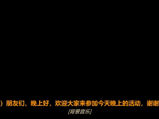

# SenseVoice Subtitle Generator

A local subtitle generator for video and audio files. It uses SenseVoice through
`sherpa-onnx` to create timed subtitles, with optional SDH-style sound and
emotion annotations.

[中文说明](README.zh-CN.md)


## What It Does

- Generates `.srt` and `.vtt` subtitles from video or audio files.
- Runs locally. No cloud API key is required after the models are downloaded.
- Uses SenseVoice for multilingual speech recognition.
- Supports normal subtitles and an SDH mode with sound/emotion labels when the
  model returns those signals.
- Can produce `.ass` subtitles and optionally burn subtitles into an `.mp4`.
- Uses `imageio-ffmpeg`, so a separate ffmpeg install is usually not needed.

## Screenshots




## How It Works

The pipeline is intentionally simple:

```text
media file
  -> ffmpeg extracts 16 kHz mono audio
  -> silero-vad splits the audio into speech segments
  -> SenseVoice decodes each segment
  -> the app writes SRT, VTT, and optional SDH/ASS outputs
```

The project uses segment-level timestamps. That is less granular than word-level
timing, but it is stable enough for normal subtitle files and avoids known
alignment issues in some SenseVoice timestamp workflows.

## SDH Mode

SenseVoice can return more than text for some segments, including language,
emotion, and audio-event tags. SDH mode uses those extra fields to produce:

- SDH-flavored SRT with labels such as `[Background music]` or emotion prefixes.
- ASS subtitles with simple emotion-based styling.
- Optional burned-in MP4 output using the generated subtitle file.

This is useful for accessibility review, content editing, and videos where
non-speech sound cues matter. The labels are model predictions, so they should be
reviewed before publishing important or public-facing work.

## Quick Start

### 1. Install

Python 3.10 or newer is recommended.

```bash
git clone https://github.com/Ha22yX/sensevoice-subtitle-generator.git
cd sensevoice-subtitle-generator

python -m venv .venv

# Windows
.venv\Scripts\activate

# macOS / Linux
source .venv/bin/activate

pip install -r requirements.txt
```

### 2. Download Models

The first run needs about 1.1 GB of model files.

```bash
python download_models.py
```

The downloader chooses a safe model directory automatically:

- If the repository path is ASCII-only, models are stored in `models/`.
- If the path contains non-ASCII characters, models are stored in a user cache
  directory instead.

Default cache paths:

```text
Windows:      %LOCALAPPDATA%\subtitle-generator\models
macOS/Linux:  ~/.cache/subtitle-generator/models
```

You can override the model directory with `SUB_MODELS_DIR`. On Windows, use an
ASCII-only path to avoid ONNX Runtime model-loading errors.

If downloads are slow, point `SUB_MODELS_BASE` to a mirror:

```powershell
# Windows PowerShell
$env:SUB_MODELS_BASE = "https://your-mirror/asr-models"
python download_models.py
```

```bash
# macOS / Linux
export SUB_MODELS_BASE="https://your-mirror/asr-models"
python download_models.py
```

### 3. Run

```bash
python app.py
```

Open <http://127.0.0.1:7860>, upload a file, choose the options you need, and
generate subtitles.

The app can also download models automatically the first time you generate
subtitles, but running `download_models.py` first makes setup failures easier to
diagnose.

## Options

| Option | Description |
| --- | --- |
| Subtitle mode | Normal SRT/VTT or SDH output with sound/emotion annotations. |
| Model precision | `int8` for smaller/faster inference, or `full` for higher precision. |
| Inference threads | CPU thread count. Auto is usually fine. |
| GPU acceleration | Attempts CUDA if a compatible `sherpa-onnx` build is installed. |
| Burn into video | Renders subtitles into a new MP4. This re-encodes the video. |

## Optional CUDA Setup

The default `sherpa-onnx` package is CPU-only. To try GPU inference, install a
CUDA build that matches your environment, then enable GPU acceleration in the UI.
If CUDA is not available, the app falls back to CPU.

```bash
pip uninstall sherpa-onnx
# Then install the CUDA build from the official sherpa-onnx instructions:
# https://k2-fsa.github.io/sherpa/onnx/install/index.html
```

## Project Layout

```text
.
├── app.py                 # Gradio UI
├── download_models.py     # model downloader
├── requirements.txt
├── subtitle_gen/          # subtitle generation package
│   ├── audio.py           # ffmpeg audio extraction and duration probing
│   ├── transcribe.py      # VAD segmentation and SenseVoice decoding
│   ├── subtitles.py       # SRT/VTT formatting and segment cleanup
│   ├── sdh.py             # SDH SRT and ASS formatting
│   └── burn.py            # subtitle burn-in with ffmpeg/libass
├── docs/                  # screenshots
├── models/                # downloaded at runtime, ignored by git
└── outputs/               # generated files, ignored by git
```

## Troubleshooting

**Model load error: `invalid unordered_map key`**

On Windows, ONNX Runtime can fail when model files are loaded from a path with
non-ASCII characters. Move the project to an ASCII-only path or set
`SUB_MODELS_DIR` to an ASCII-only directory, then run `python download_models.py`
again.

**ffmpeg error**

The project uses `imageio-ffmpeg`, which usually provides ffmpeg automatically.
Reinstall dependencies if ffmpeg is missing:

```bash
pip install -r requirements.txt
```

**Timestamps are not word-level**

This project currently writes segment-level subtitles. Word-level or
karaoke-style timing would need a separate alignment step.

**Audio-only files**

The UI is video-oriented, but the pipeline is ffmpeg-based and can handle many
audio formats as input.

## License

The project code is released under the [MIT License](LICENSE).

Models are downloaded at runtime and remain under their own licenses. Check the
upstream projects before redistributing model files:

- [SenseVoice](https://github.com/FunAudioLLM/SenseVoice)
- [sherpa-onnx](https://github.com/k2-fsa/sherpa-onnx)
- [silero-vad](https://github.com/snakers4/silero-vad)

## Acknowledgements

Built on SenseVoice, sherpa-onnx, silero-vad, Gradio, and imageio-ffmpeg.
