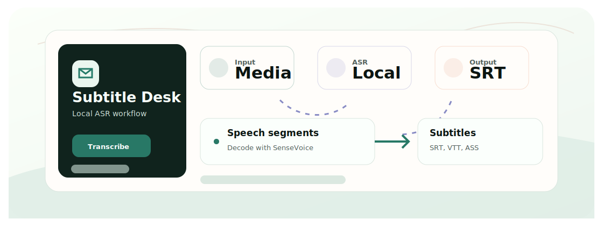

<div align="center">
  <h1>SenseVoice Subtitle Generator</h1>
  <p>A local subtitle generator that turns media files into SRT/VTT subtitles with SenseVoice and sherpa-onnx.</p>

  <p>
    <a href="README.zh-CN.md">Chinese</a>
    &middot;
    <a href="#quickstart">Quickstart</a>
    &middot;
    <a href="#tech-stack">Tech Stack</a>
  </p>

  <p>
    
    
    
    
  </p>
</div>

<p align="center">
  
</p>

<p align="center">
  
  
</p>

## Why This Exists

Subtitle generation should be usable without sending every media file to a cloud API. This app downloads local models once, then produces normal and SDH-style subtitle outputs from a Gradio UI.

## Workflow

- Upload an audio or video file.
- Extract 16 kHz mono audio through the bundled ffmpeg path.
- Split speech with VAD and transcribe segments with SenseVoice.
- Write SRT/VTT outputs and optional SDH/ASS outputs.
- Optionally burn subtitles into an MP4 for review.

## Features

- Generate SRT and VTT from media files.
- Runs locally after model download; no cloud API key required.
- Optional SDH labels and ASS/burn-in subtitle path.
- Gradio UI with practical model path and ffmpeg handling.

## Quickstart

```bash
git clone https://github.com/Ha22yX/sensevoice-subtitle-generator.git
cd sensevoice-subtitle-generator
python -m venv .venv
.venv\Scripts\activate
pip install -r requirements.txt
python download_models.py
python app.py
```

Open `http://127.0.0.1:7860`. The first model download is about 1.1 GB.

## Tech Stack

| Layer | Technology | Role |
| --- | --- | --- |
| ASR | SenseVoice via sherpa-onnx | Local speech recognition. |
| Audio | imageio-ffmpeg, VAD | Extract and split speech segments. |
| UI | Gradio | Upload files and export subtitles. |
| Output | SRT, VTT, ASS, MP4 burn-in | Subtitle formats and optional rendered video. |

## Project Map

```text
app.py                    Gradio interface
download_models.py        model downloader
subtitle_gen/             audio, transcription, subtitle, SDH, burn modules
docs/                     screenshots and documentation
requirements.txt          Python dependencies
```

## Notes

Review generated text and SDH labels before publishing important public subtitles.

## License

MIT License. See [LICENSE](LICENSE).
